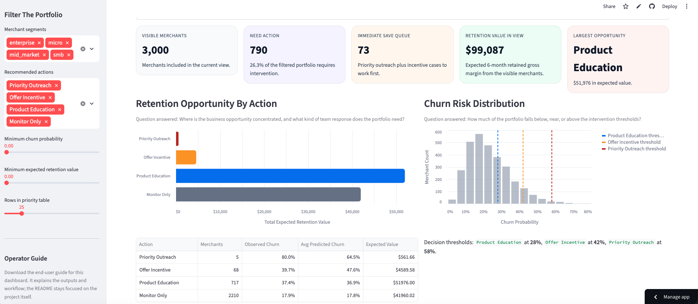
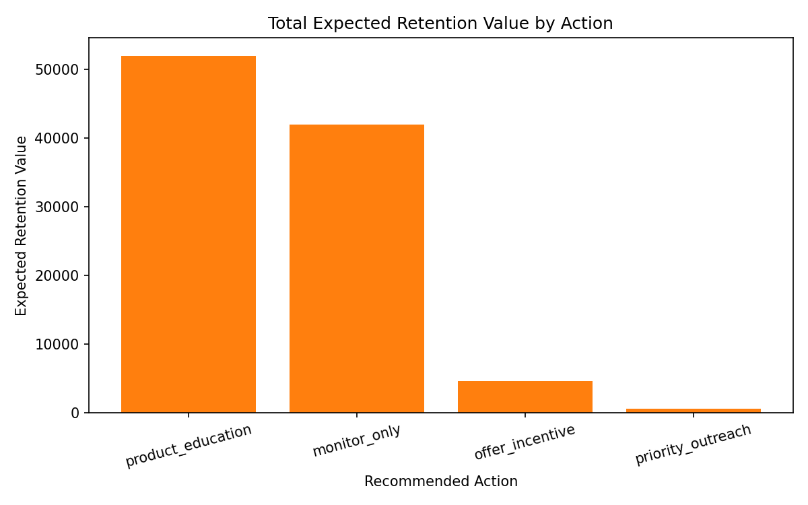
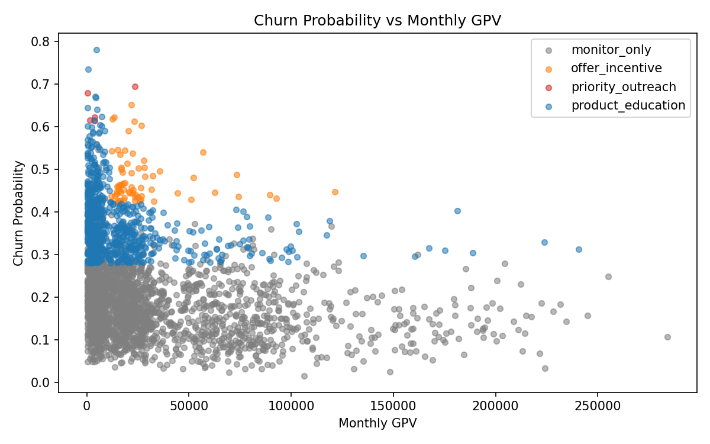
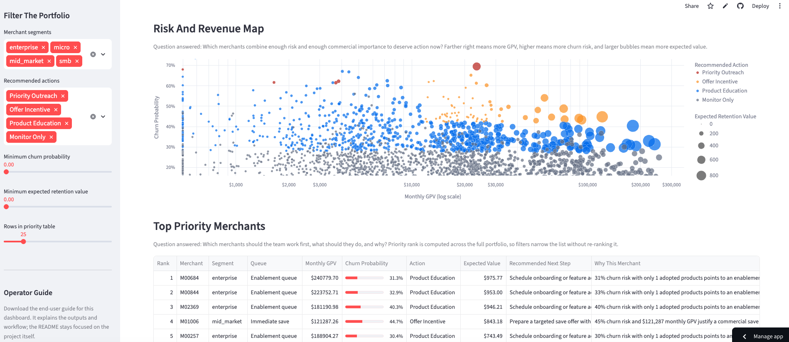
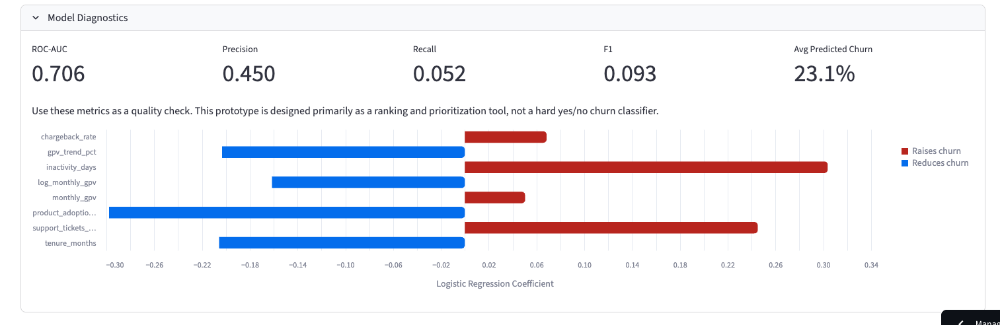

# Merchant Retention Decision Engine

A portfolio-ready prototype for a payments company that combines churn prediction with a business decision engine for merchant retention.

The project simulates a realistic merchant portfolio, estimates churn risk with a transparent logistic regression model, and converts model output into business actions such as priority outreach, incentives, product education, or monitoring. The emphasis is on operational decision-making rather than model complexity.

## Live dashboard

[Open the public Streamlit app](https://merchantretentiondecisionengine-paolorivaslegua.streamlit.app/)

## Portfolio highlights

- end-to-end local Python pipeline
- synthetic payments portfolio with realistic churn drivers
- interpretable churn model using logistic regression
- rule-based retention decision engine with explicit business logic
- ranked merchant work queue based on expected retention value
- Streamlit dashboard designed for business users, not just model reviewers

## Business question

How should a payments company identify merchants at risk of churn, decide what retention action to take, and prioritize the highest-value interventions first?

This project answers that question by combining merchant risk signals, churn scoring, action rules, and expected-value ranking into a single workflow.

## Dashboard overview



## Why this project

Payments companies often know which merchants are struggling only after GPV declines materially or a merchant stops processing. This prototype shows how a retention team can move earlier by combining:

- behavioral and operational merchant signals
- a simple churn probability model
- a rule-based action framework
- expected value prioritization for outreach

## What this repo demonstrates

- translating an ML output into an operational workflow
- balancing model simplicity with business usability
- building a reproducible analytics product rather than a standalone notebook
- designing dashboards and explanations for non-technical users

## Project structure

```text
merchant_retention_decision_engine/
├── README.md
├── requirements.txt
├── .gitignore
├── data/
│   ├── raw/
│   └── processed/
├── notebooks/
│   └── exploration.ipynb
├── outputs/
│   ├── figures/
│   ├── models/
│   └── tables/
├── src/
│   ├── __init__.py
│   ├── app.py
│   ├── config.py
│   ├── data_generation.py
│   ├── decision_engine.py
│   ├── evaluation.py
│   ├── features.py
│   ├── model.py
│   └── pipeline.py
└── tests/
    └── test_decision_engine.py
```

## What the pipeline does

1. Generates a synthetic merchant dataset if raw data is missing.
2. Builds a feature set with core payments and engagement signals.
3. Trains a logistic regression churn model.
4. Scores every merchant with a churn probability.
5. Applies business rules to recommend a retention action.
6. Estimates expected retention value and assigns a priority rank.
7. Saves charts, tables, and the trained model to disk.

## Core outputs

After running the pipeline, the project produces:

- merchant-level action recommendations in `outputs/tables/merchant_retention_actions.csv`
- model metrics and coefficient summaries in `outputs/tables/`
- charts in `outputs/figures/`
- a saved sklearn pipeline in `outputs/models/logistic_regression.joblib`
- a Streamlit dashboard backed by the generated artifacts

## Visual previews

Expected retention value by action:



Merchant risk and revenue map:



These are generated pipeline outputs. For a public portfolio repo, the strongest presentation is to pair them with actual dashboard screenshots.

## Merchant features

The synthetic dataset includes:

- `monthly_gpv`
- `gpv_trend_pct`
- `chargeback_rate`
- `support_tickets_90d`
- `product_adoption_count`
- `tenure_months`
- `inactivity_days`
- `segment`
- `churned`

## Recommended actions

- `priority_outreach`: highest-risk merchants with strong revenue importance or severe operational stress
- `offer_incentive`: high-risk merchants where a commercial intervention is justified
- `product_education`: medium-risk merchants where deeper product adoption is the main lever
- `monitor_only`: lower-risk merchants that do not currently warrant intervention

## Local setup on macOS

From the project root:

```bash
python3 -m venv .venv
source .venv/bin/activate
pip install -r requirements.txt
```

## Run the pipeline

```bash
python -m src.pipeline
```

This command will:

- generate `data/raw/merchants.csv` if it does not exist
- save the processed dataset to `data/processed/merchant_features.csv`
- save merchant-level recommendations to `outputs/tables/merchant_retention_actions.csv`
- save model metrics, action summaries, top priorities, and coefficient tables
- save charts to `outputs/figures/`
- save the trained logistic regression pipeline to `outputs/models/logistic_regression.joblib`

## Typical local workflow

```bash
python -m src.pipeline
streamlit run src/app.py
python -m unittest discover -s tests
```

## Launch the Streamlit app

Run the pipeline first, then:

```bash
streamlit run src/app.py
```

The app loads saved artifacts and provides:

- KPI cards
- action mix and risk distribution charts
- a filterable table of top merchants to retain
- a sidebar operator guide download for non-technical users

## Dashboard views

### Risk and revenue map with ranked merchant queue



## Deploy as a public website

The cleanest option for this project is Streamlit Community Cloud because the app is already built in Streamlit and the repository is hosted on GitHub.

High-level deployment steps:

1. Push the repository to GitHub.
2. Create or sign in to a Streamlit Community Cloud account.
3. Connect your GitHub account to Streamlit Community Cloud.
4. Deploy this repository and set the app entrypoint to `src/app.py`.

The app is designed to generate its synthetic data, model artifacts, and dashboard outputs automatically on first launch, so it does not require committed CSV outputs to run publicly.

## Example business outputs

The merchant-level output includes:

- `churn_probability`
- `recommended_action`
- `expected_retention_value`
- `priority_rank`

This creates an operational queue for a retention team instead of just a risk score.

## Why this modeling approach fits the product

This project uses logistic regression on purpose because the goal is not to chase maximum benchmark performance. The goal is to support a believable retention workflow that a business team can understand and act on.

For a first-pass merchant retention engine, interpretability matters. A risk score is much more useful when it can be explained in terms of concrete merchant signals such as inactivity, GPV trend, chargebacks, support demand, and product adoption. Logistic regression gives this prototype a transparent baseline that is easy to inspect, fast to run locally, and strong enough to support prioritization and decision rules.

That makes the model a good fit for the story this project is telling:

- the score is understandable, not opaque
- the coefficients make the main churn drivers visible
- the model is lightweight enough for a local demo and public deployment
- the emphasis stays on turning risk into action, not on model complexity for its own sake

### Model diagnostics and feature direction



## Why synthetic data is acceptable here

This repository is meant to demonstrate retention strategy, decision-support design, and analytics engineering without exposing sensitive merchant information. Synthetic data keeps the project shareable while still allowing realistic product and modeling tradeoffs.

## Synthetic data note

The dataset is synthetic, but it is designed with correlated payments behaviors rather than random independent columns. Negative GPV trends, rising inactivity, high chargebacks, and frequent support issues increase churn risk, while higher tenure and broader product adoption reduce it. That makes the prototype useful for demonstrating product thinking, pipeline design, and decision logic without exposing sensitive merchant data.

## Limitations

- synthetic rather than production merchant data
- simple single-model approach
- static rule engine instead of learned treatment optimization
- no experiment framework for measuring real retention uplift

## Future enhancements

- compare logistic regression with tree-based models
- tune action thresholds by segment
- estimate action ROI from historical intervention outcomes
- add cohort views and scenario analysis to the Streamlit app
- schedule the pipeline for recurring portfolio refreshes

## Testing

Run the unit tests for the decision engine with:

```bash
python -m unittest discover -s tests
```

## Notes for a public GitHub repo

- generated CSVs, figures, and models are ignored by default and should be regenerated locally
- the dashboard and pipeline are fully local; no external APIs or secrets are required
- if publishing the repo, consider adding dashboard screenshots to the README for faster portfolio scanning
